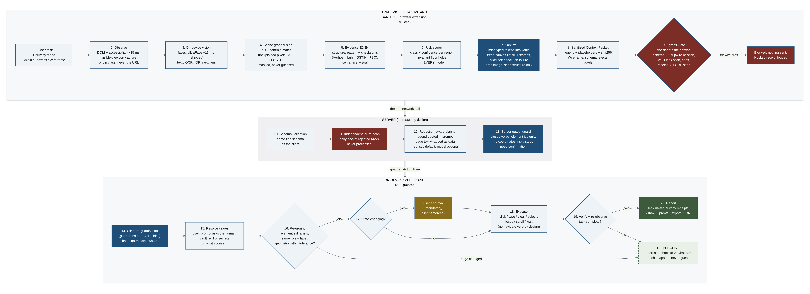

# Dravika

A privacy-preserving vision agent that runs in your browser. A local eye, a remote brain,
and an unbreakable filter in between.

Designed for privacy-preserving browser task assistance with on-device perception and guarded actions.

## The idea in one paragraph

A browser extension looks at the current page using the DOM, the accessibility tree, and
small on-device vision models. Everything sensitive is destroyed locally before anything
leaves the machine: values become typed placeholders (PII:AADHAAR#1), pixels get flat-filled
on a fresh canvas, and anything that cannot be positively explained is masked by default.
The server receives a formal, versioned Sanitized Context Packet, is told the redaction
scheme in the packet itself, and answers with actions that name element IDs, never
coordinates. One function in the whole codebase is allowed to touch the network.

Implementation and measured limits: [docs/IMPLEMENTATION-EVIDENCE.md](docs/IMPLEMENTATION-EVIDENCE.md).



## Results at a glance

All numbers can be reproduced with the commands below. The full tables and
known limits are in [bench/RESULTS.md](bench/RESULTS.md) and
[docs/IMPLEMENTATION-EVIDENCE.md](docs/IMPLEMENTATION-EVIDENCE.md).

| What | Result | Reproduce |
|---|---|---|
| PII redaction, Shield mode (18 synthetic captures, 55 items) | **100% precision, 89.1% recall**, 0 invariant-class leaks | `npm run bench` |
| PII redaction, Fortress mode | **98.1% precision, 94.5% recall**, 0 invariant-class leaks | `npm run bench` |
| Local perception latency (Intel i3-6100U, single-thread WASM) | **71.2 ms p50** end to end, 54.4 ms of it face inference | `npm run bench:latency` |
| Unit tests | **258 passing** across five workspaces | `npm test` |
| Network egress | Build fails if any network API is used outside the two allowlisted transport modules | `npm run check:egress` |
| End-to-end browser runs | Google- and Microsoft-style forms, image/PDF upload approval, QR masking | `npm run test:browser` |
| On-device model footprint | ~1.27 MB UltraFace ONNX, ~2.95 MB OCR language data, ~2.86 MB OCR WASM | n/a |

**Guarantees enforced in code, not policy:**

- Raw values never leave the device. The server only ever sees typed
  placeholders such as `PII:AADHAAR#1`.
- If something can't be explained, it gets masked. Unrecognised media and
  identity documents are fully masked.
- The planner names element IDs only and never coordinates. It cannot override
  local validation, confirmation or execution.
- Every request produces a receipt, and every upload needs explicit human
  approval of the sanitized preview.

## Layout

```
packages/core        pure TypeScript, zero browser APIs: schemas, detectors, policy, vault, gate, fusion
packages/perception  model loading and inference (WebGPU / WASM)
packages/ui          side panel UI
apps/extension       Chrome MV3 + Firefox builds from one codebase
apps/server          planner service; shares the zod schemas with the client
bench/               RedactBench-Web corpus, red team suite, task runner
docs/                the full report, threat model, data policy
tools/               build utilities
```

Package docs: [core](packages/core/README.md) ·
[perception](packages/perception/README.md) ·
[extension](apps/extension/README.md) · [server](apps/server/README.md) ·
[bench](bench/README.md) · [tools](tools/README.md)

## Running the Tier 0 demo

Tier 0 is the structure-only fallback: the DOM and accessibility data drive
the form loop, and PII is caught by validators and checksums. Shield and
Fortress also run the bundled UltraFace face detector locally through
ONNX Runtime Web's CPU/WASM backend, without requiring a GPU adapter; Wireframe sends
zero pixels. If capture or model assets are unavailable, the structure-only
path remains available and unexplained media stays masked.

```
npm install
npm test                      # workspace tests incl. the end-to-end loop
node bench/demo/serve.mjs     # demo form at http://127.0.0.1:8080
npm run dev # builds the extensions and starts the local planner
npm run build # builds Chrome MV3 and Firefox MV2 extensions
```

Then load the extension:

- **Chrome**: chrome://extensions, enable Developer mode, "Load unpacked",
  pick `apps/extension/dist/chrome`. Click the Dravika toolbar icon to open
  the side panel.
- **Firefox**: about:debugging, "This Firefox", "Load Temporary Add-on",
  pick `apps/extension/dist/firefox/manifest.json`. Open the Dravika sidebar.

Open the demo form, press **Start / resume task**, type "Help me complete this form"
in the task dialog, and press **Run**.
Watch the "What the server sees" pane: Aadhaar, email, and phone become typed
placeholders, while detected faces are represented as redacted visual regions;
the 12 digit application reference survives untouched because it fails the
Verhoeff checksum. Every request produces a receipt.

An optional remote planner can be configured through an OpenAI-compatible chat
endpoint. Copy `.env.example` to `.env`, set the endpoint, model and API key,
then run `npm run dev`. The panel identifies local processing separately from
any remote planner. Remote advice receives sanitized context only; form order,
answer collection, validation, confirmation and execution remain locally guarded.
Leave the endpoint unset to use the local heuristic planner. Do not commit `.env`.

## The single-door rule

`npm run check:egress` (part of `npm test`) fails the build if `fetch` or any
other network API appears outside the two allowlisted transport modules. The
EgressGate is the only path to the network, and everything it sends passed a
schema check, a full detector re-scan and a vault leak scan first.

Node 20+ required.

## Local image/PDF inspection

File-upload questions ask for a local JPEG, PNG, WebP or PDF in a dialog
(up to 20 MiB; PDF preview pages 1–50 are selected in that same dialog).
Local inspection runs automatically. The sidebar shows the original image/page
for local comparison beside the freshly encoded blacked-out preview and sanitized
JSON; it has no separate file picker. The original comparison is never uploaded.
PDF pages and images with unlocalized identity/signature content remain fully
masked. Shield mode can preserve medium-risk names while Aadhaar, phone, email
and other high-risk regions are flat-filled. A value-free audit lists metadata
fields, detected classes and PDF features discarded. English OCR and vision
assets are SHA-pinned; integrity or pixel-check failures block sending.
The media JSON is labelled as a local preview, not a sent planner request.
After the preview is ready, a **Review before upload** dialog asks for approval
once. Only the approved blacked-out file is attached to the website; rejecting
it leaves the upload field empty. Images use an accepted sanitized image format;
PDFs become a new raster-only PDF containing just the reviewed page. The sidebar
JSON records the sanitized upload's hash and approval/attachment state. Original
file bytes, extracted OCR text and metadata values are not sent to the planner.
Activity and privacy checks are available in collapsed details.

QR masking locates finder-pattern geometry without requiring a successful payload
decode, including dense/damaged and multiple-code cases. Inverted code patterns
are also checked; credible but unresolved finder patterns trigger full-frame
masking. Aadhaar/identity-document upload fields use full-image masking when no
QR/code region can be localized. The audit identifies this pipeline with
`pipeline_version: "2026.09.30-qr-geometry"`.

After upload approval, the agent refreshes the target locally and retries stale
snapshots without another planner call or approval. Direct file inputs and
accessible same-origin dialog/iframe pickers are supported. If a picker is
inaccessible or the website does not confirm the upload, the sidebar reports
failure, with `website_upload.failure_reason` in the preview JSON. Closed/reused
pickers are recognized by actual visibility rather than DOM existence. The
helper waits for upload progress and an enabled Insert/Select control before
completing the picker, then verifies the form acknowledgement without uploading
the file again. Stop
cancels a pending picker operation before file dispatch.
**Activity → Export activity** downloads payload-free upload diagnostics
(snapshot/target IDs, retry reasons and dispatch/confirmation stages). Upload
events are browser-side; they do not appear in the local planner's server log.

Run `npm run test:browser` for the isolated Chromium form and media pipeline
checks, including PDF upload approval, iframe picker ingestion, and QR detection/
blacking in image and PDF fixtures. See [implementation evidence](docs/IMPLEMENTATION-EVIDENCE.md) for
measured results and limitations. For predictable form steps, use
`PLANNER_MODE=heuristic npm run dev` after stopping any previous planner.
